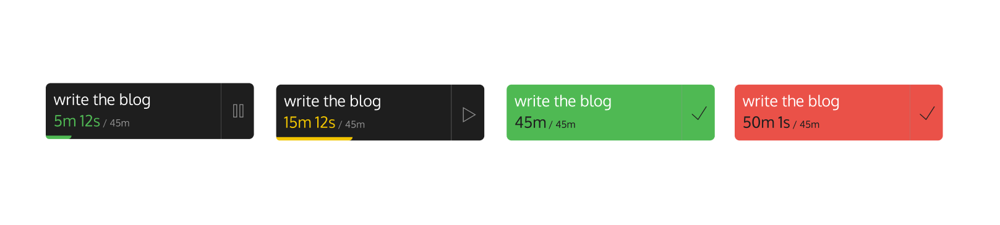

## Focus Timer

A PIP style timer window for macOS, inspired from sunsama.

What & Why? 
- A floating timer that always stays on the top of all windows, helping you say no to distractions and timebox your tasks.
- The timer initially counts from 0 to the set time. Once the timer finishes, it turns green and then overflows if you don't stop it.
- The overflow has a threshold of 5 minutes, after which the window turns red, indicating that you should stop the current task.
  - The timer turning red can imply one of two things: either you were not efficient, or you didn't estimate the time correctly, disrupting your schedule.
- Upon finishing each timer state, it plays a series of very gentle gong sounds.